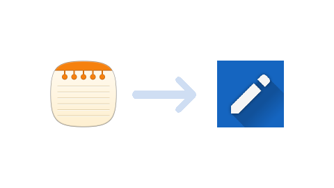

# samsung-memos-to-json
## Convert Samsung memos to import them in "Another notes app"

	

If you've used the old Samsung memo app, you'll realize that you're kind of locked
in with that brand for your notes. It's either copy and paste or leave them behind.

User `audiomason` on StackExchange posted a [solution](https://android.stackexchange.com/a/172787).

## Prerequisites
* Having a computer with command line access and 
	* `python3`, `pip` (download from [here](https://www.python.org/))
	* BeautifulSoup4 (download using `pip install beautifulsoup4`)

Tested on Linux, but it should work on any platform.

## Usage
* In the memos app, select all of them and share them.  
This is to create the `.memo` files.
* Locate the notes directory on Android.  
For the Samsung Galaxy S7, `Internal Storage/ShareMemo`  
This may be different on your device.
* Copy the `.memo` files to your computer in an empty directory.
* Clone or download this repo and open a terminal in it.
* `$ python3 samsung-memo-to-notes.py path/to/memos path/to/output.json` 
Replace paths in this command accordingly.
* Send this output file back to your Android device.
* Install "[Another notes app](https://f-droid.org/en/packages/com.maltaisn.notes.sync/)" and import json data

Stuck ? Use the integrated help.  
`$ python3 samsung-memo-to-notes.py --help`

## How does this work
As said in the StackExchange thread, memos are just a zip archive containing a `media` directory and a `memo_content.xml` file.

In this xml file : 
* `./contents/content` contains the note's text as encoded HTML, 
* `./headers/meta[@title]` contains the title,  
* `./headers/meta[@createdTime]` contains the creation time as a Unix timestamp.

This script extracts every note in a temporary directory, read their xml data, stores it in memory then deletes the temporary directory. After this, the data is converted as necessary and the resulting notes are aggregated in a `dict`. This is then written to the output file as JSON.